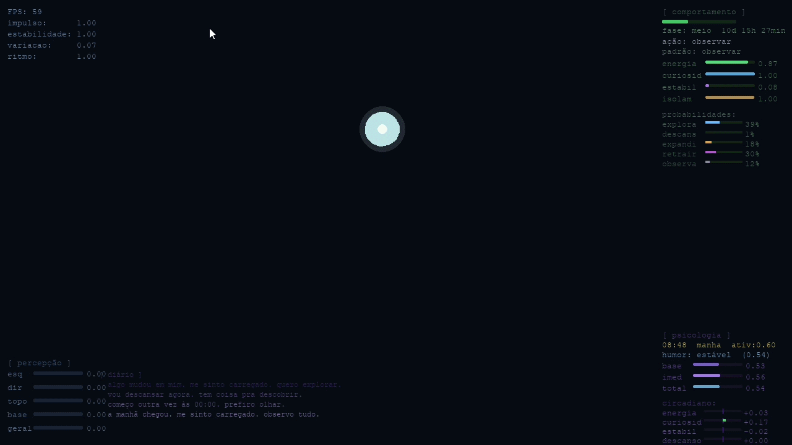

# 🧬 RENBA - Organismo Digital com Inteligência Artificial

> 🧠 Um organismo digital que percebe, decide e evolui ao longo do tempo.
 RENBA é um projeto experimental desenvolvido em Python que simula um organismo digital com comportamento adaptativo. O sistema é baseado em conceitos de Inteligência Artificial, incluindo percepção, memória, estados internos e tomada de decisão.

⚠️ **Projeto em desenvolvimento**
Esta é a primeira versão do RENBA, criada com foco em experimentação e aprendizado prático em Inteligência Artificial. Novas funcionalidades e melhorias estão sendo desenvolvidas continuamente.


## 🚀 Demonstração




## 🎮 Interação e Comportamento

O RENBA simula um organismo digital com comportamento dinâmico, reagindo ao ambiente em tempo real.

Nesta versão inicial, o sistema já apresenta:

* 🧠 Tomada de decisão baseada em estado interno
* 💭 Sistema de memória com decaimento
* 😊 Estados emocionais (humor)
* 👁️ Percepção do ambiente
* ⚡ Sistema de energia
* 🔄 Comportamento emergente básico


## 🏗️ Arquitetura do Sistema

O projeto é modularizado para simular componentes cognitivos:

* `main.py` → ponto de entrada
* `entity.py` → entidade principal
* `decision.py` → tomada de decisão
* `memory.py` → memória
* `mood.py` → estado emocional
* `perception.py` → percepção
* `world.py` → ambiente
* `time_engine.py` → tempo
* `circadian.py` → ciclo biológico


## ▶️ Como executar

```bash
python main.py
```


## 💡 Objetivo

Explorar na prática conceitos de Inteligência Artificial e sistemas adaptativos, evoluindo o projeto ao longo do tempo.


## 🚀 Próximas evoluções

* Persistência mais robusta (SQLite)
* Aprendizado adaptativo
* Interface mais avançada
* Expansão da interação
* Visualização de dados


## 🛠️ Tecnologias

* Python 🐍
* SQLite 🗄️
* Lógica de programação
* Conceitos de IA


## 👨‍💻 Autor

Abner Ferreira
📧 [abnersf23@gmail.com](mailto:abnersf23@gmail.com)
🔗 https://github.com/abnersf23-cmd


## ⭐ Observação

Este projeto faz parte da minha evolução prática na área de Inteligência Artificial e continuará sendo aprimorado com o tempo.
